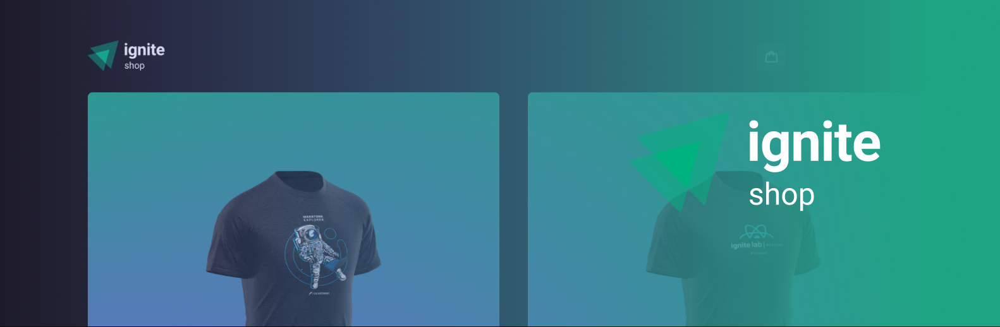
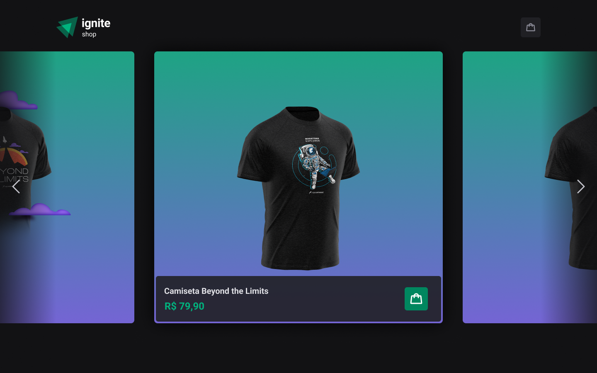
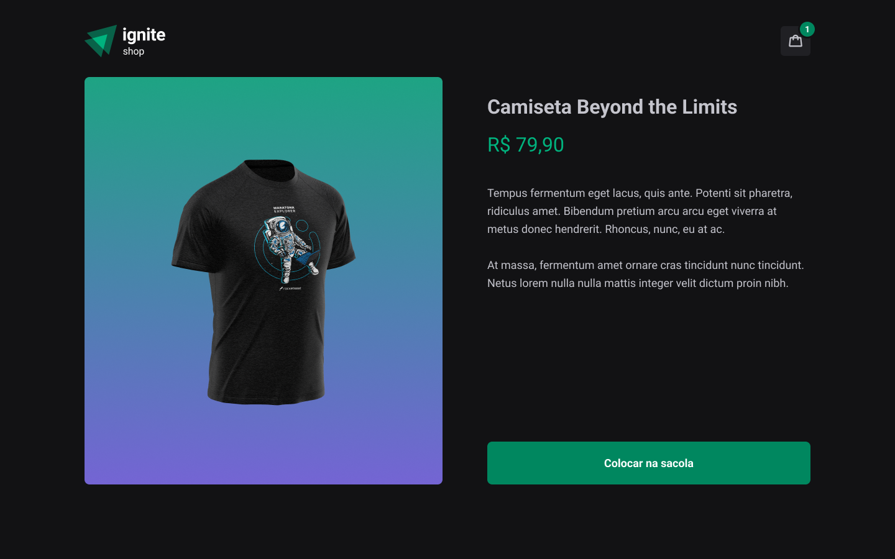
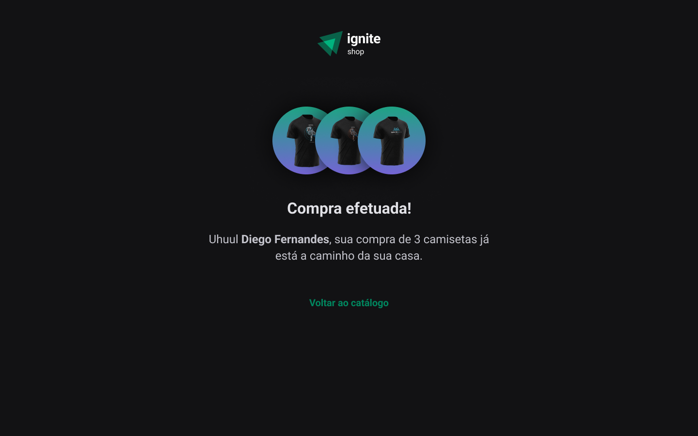

<p align="center">
  
  
  <a href="https://github.com/jsnevt/README-ign_shop/commits/master">
    
  </a>
    
   
   
  <a href="https://rocketseat.com.br">
    
  </a>

</p>

<h1 align="center">
    
</h1>

<h4 align="center"> 
	🚧  Ignite Shop - Concluído 🚀 🚧
</h4>

<p align="center">
 <a href="#-sobre-o-projeto">Sobre</a> •
 <a href="#-funcionalidades">Funcionalidades</a> •
 <a href="#-layout">Layout</a> • 
 <a href="#-como-executar-o-projeto">Como executar</a> • 
 <a href="#-tecnologias">Tecnologias</a> •  
 <a href="#-autor">Autor</a> • 
 <a href="#user-content--licença">Licença</a>
</p>

## 💻 Sobre o projeto

Ignite Shop - Aplicativo desenvolvido durante os desafios da trilha Ignite da Rocketseat. A aplicação consiste de uma tela com alguns
itens para serem escolhidos como itens de compra (camisas). Após escolhidos, clicamos no item do carrinho que nos encaminhará para a API do Stripe, para informarmos
os dados de pagamento através do cartão de crédito. Esta aplicação foi desenvolvida para explorarmos esse recurso: API de pagamento. Esta API age como uma interface 
de aplicação interagindo com a plataforma Stripe para validar os dados. Quando validados, nossa aplicação retorna a confirmação da compra.

Projeto frontend desenvolvido durante o curso online (Ignite) oferecido pela [Rocketseat].

---

## ⚙️ Funcionalidades

- [x] Etapas da aplicação:
	- Escolha dos itens
	- Finalizando entrando no carrinho de compras
	- Informando dados de pagamento do cartão de crédito

- [x] API do Stripe:
	- Valida os dados do cartão e concretiza a operação

- [x] Aplicação:
	- Ao finalizar o processo, é enviado uma mensagem de confirmação com os itens do pedido realizado.

---

## 🎨 Layout

O layout da aplicação está disponível no Figma:

<a href="https://www.figma.com/file/x5d6PByTDhwD6f3gRrj5dM/Ignite-Shop-2.0-(Copy)?type=design&node-id=0-1&mode=design&t=X9urGgqMRuw7axB5-0">
  
</a>


### Web

<p align="center" style="display: flex; align-items: flex-start; justify-content: center;">
  
  
  
</p>

---

#### 🧭 Rodando a aplicação web (Frontend)

```bash

# No prompt de comando:
# Crie uma pasta onde desejar
# Acesse a pasta, e no terminal:

# Clone este repositório
$ git clone https://github.com/jsnevt/ign_shop.git

# No VSCode, abra a pasta onde o arquivo foi clonado e abra o projeto

# Dentro do terminal do VS Code, instale as dependências
$ npm i

# Acesse o terminal do VS e execute a aplicação em modo desenvolvimento
$ Digite "num run dev" (sem as aspas)

A aplicação será aberta - acesse http://localhost:3000

```
---

## 🛠 Tecnologias

As seguintes ferramentas foram usadas na construção do projeto:

#### **Website**  ([React](https://reactjs.org/)  +  [TypeScript](https://www.typescriptlang.org/))

-   **[https://github.com/phosphor-icons/homepage](https://github.com/phosphor-icons/homepage)**
-   **[Axios](https://github.com/axios/axios)**
-   **[https://www.radix-ui.com](https://github.com/radix-ui/primitives)**
-   **[https://stitches.dev/](https://github.com/stitchesjs/stitches)**
-   **[Stripe](https://github.com/stripe)**
-   **[Keen-slider](https://github.com/rcbyr/keen-slider)**


> Veja o arquivo  [package.json](https://github.com/JsnEvt/coffeedelivery/blob/main/package.json)

## 💪 Como contribuir para o projeto

1. Faça um **fork** do projeto.
2. Crie uma nova branch com as suas alterações: `git checkout -b my-feature`
3. Salve as alterações e crie uma mensagem de commit contando o que você fez: `git commit -m "feature: My new feature"`
4. Envie as suas alterações: `git push origin my-feature`
> Caso tenha alguma dúvida confira este [guia de como contribuir no GitHub](./CONTRIBUTING.md)

---


## 🦸 Autor

[](https://www.linkedin.com/in/jason-everton-041226223/)

[](mailto:jasonemsw10@gmail.com)


## 📝 Licença

Este projeto esta sobe a licença [MIT](./LICENSE).

Feito com ❤️ por Jason Everton 👋🏽 [Entre em contato!](https://www.linkedin.com/in/jason-everton-041226223/)

---

